# Vulkan

Vulkan是 高性能3D图形和计算API，可用于现代GPU管线架构。
Vulkan是一个显示API，保证用户在渲染时保持稳定平滑的帧速率，不会造成延迟或者故障。

## Vulkan及其演化史

Vulkan并不是目前唯一的新一代3D图形API，例如Microsoft的Direct-X 12 和 Apple的Metal。
不过，Direct-X 只能用于不同的Windows系统，而Metal只能用在Mac系统（OS X 和 iOS）。因此，
Vulkan得以脱颖而出。它的跨平台特性可以支持所有现存的OS平台，其中已经包括了Windows(XP、Vista,7,8,10)、
Linux、Tizen、SteamOS和Android。

## Vulkan与OpenGL的对比

Vulkan相比OpenGL有了不少的新特性和性能提升。

- 降低驱动负载和CPU的使用量

- 多线程的可扩展性

- 显示的API定义 (OpenGL的API是隐式的，资源管理工作交给驱动层去完成)

- Vulkan采用了显示的API定义，驱动并不负责资源以及资源之间相关关系的管理。用户任务的处理可以直截了当地以流水线的方式完成，从而获得最佳性能和可预测的行为模式。

- 预编译的中间级着色语言(OpenGL需要使用OpenGL着色语言(GLSL)源代码来实现着色器，而Vulkan使用可移植的标准化中间级语言(SPIR-V)作为中间级语言标准)

- 驱动层和应用程序层 (Vulkan 驱动层更为接近硬件底层，负载较小)

- 内存的控制 (Vulkan暴露了系统多种类型的内存接口。OpenGL交给驱动层内部处理机制来完成资源存储)

- 可预测行为 (Vulkan行为比OpenGL有更高的行为可预测性)

- 单一的API (OpenGL有多个独立的版本，而Vulkan只提供了单一的API接口)

- 直接访问GPU 

- 错误检查和验证 (Vulkan可自己控制开闭错误检查和验证)

- 支持多种类型的GPU硬件

## 一些必需的预备知识

> 物理设备与设备 (独立设备 与 物理设备在APP中的逻辑表示)

> 队列 (队列表示执行引擎与应用程序之间的接口，队列的职责是收集准备执行的工作(指令缓存)并分发到物理设备执行。)

> 内存类型 (广义:宿主内存和设备内存)

> 指令 (每个指令中都可以执行一些用户行为。指令从广义上可以划分为动作、状态设置、以及同步)

> 动作指令 (包括绘制图元、清除表面、复制缓存、查询/时间戳操作,以及子通道的开始/结束操作。这些指令可以修改帧缓存附件、读取或者写入内存(缓存或者图像)、以及写入查询池)
> 状态设置指令 (这些指令可以用来绑定流水线、描述字集合以及缓存，或者设置一个动态状态，以及渲染通道/子通道的状态)
> 同步指令 (同步指令用于处理两个或者更多动作指令同时发生的情况，此时指令之间可能会争夺资源或者依赖于某些内存。该指令用来设置同步事件或者等待事件、插入流水线屏障对象，以及渲染通道/子通道的依赖)

>指令缓存 (指令缓存是一组指令的集合，它可以记录多个指令并统一发送到队列中)

## 学习Vulkan的基础概念

### Vulkan的执行模型

>支持Vulkan的系统可以直接查询系统信息
> 每个物理设备可以支持一个或多个队列
> 每个族群有自己独特的功能设定，队列划分到不同的族群中(ep:一个族群坑你会支持诸如图形、计算、数据传输，或者内存管理相关的功能)
> 队列族群中的每个成员可能包含了一个或者多个相似的队列

>Vulkan允许用户显示地在应用程序中管理和控制内存
> 它暴露了设备中支持的所有不同类型的内存堆(heap),每个堆属于一个不同的内存区域。

>Vulkan的应用程序负责控制一组Vulkan设备，将一系列指令记录到指令缓存中，并发送到队列。
> 驱动会读取队列并按照记录的顺序依次执行各个工作。

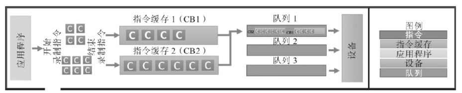   

Vulkan中，用户应用程序主要负责的工作：
   生产指令执行所必必需的所有先决内容：
   其中可能包括资源的准备、着色器的预编译、将资源关联到着色器、设置着色器的状态、构建流水线、以及绘制调用。
   内存管理
   同步
   宿主和设备之间
   设备上不同队列之间
   风险管理

### Vulkan的队列

  队列是Vulkan的一种中间层机制，负责接收指令缓存并传递给设备。指令缓存记录了一个或者多个指令，并发送给相关的队列。

  指令缓存的发送方式：

  > 单一队列:
  >        按照指令缓存发送的顺序进行维护，以及执行或者回放。
  >        指令缓存按照串行的方式执行。

  > 多重队列：
  >       允许指令缓存以并行的方式在两个或者更多队列中执行。
  >       除非特别指定，否则无法保证指令缓存发送和执行的顺序不变。需要负责进行此类同步操作。

  Vulkan提供多种同步图元：
         信号量： 粗粒度指令缓存中执行
         事件  ： 事件控制细粒度同步
         栅栏  ： 允许在宿主和设备之间完成同步
         流水线屏障   ： 确保指令它之前优先执行，之后的指令随后执行。

### 对象模型

  应用程序端，包括设备、队列、指令缓存、帧缓存、流水线等在内的所有对象，统称为Vulkan对象。
  在内部的API层面，这些Vulkan对象会被识别为不同的句柄。分为： 可分发以及不可分发。

  可分发的句柄：这类指针指向了一个不透明的内部图形实体。不透明的数据类型不允许直接访问它的内部结构体成员，只能通过API函数访问结构体的内部域。

| Vkinstance | VkCommandBuffer | VkPhysicalDevice | VkDevice | VkQueue |
| ---------- | --------------- | ---------------- | -------- | ------- |
|            |                 |                  |          |         |

不可分发的句柄：这些64位整型类型的句柄通常不会指向一个结构体，而是直接包含了对象自身的信息。

| VkSemaphore      | VkFence    | VkQueryPool    | VkBufferView  | VkDeviceMemory  |
| ---------------- | ---------- | -------------- | ------------- | --------------- |
| VkBuffer         | VkPipeline | VkShaderModule | VkCommandPool | VkPipelineCache |
| VkPipelineLayout | ...        |                |               |                 |

### 对象生命周期与指令语法

  Vulkan当中的对象是根据应用程序的逻辑需求显示地创建和销毁的，应用程序需要自己管理这些对象。

  Vulkan 对象需要使用Create指令创建，以及使用Destroy指令销毁：
  Create语法：vkCreate* 指令
  Destroy语法：vkDestory* 指令
  Allocate语法: vkAllocate* 指令
  Free语法：vkFree* 指令从对象池或者内存中释放

  实现方法可以通过vkGet*指令轻松获取，使用了vkCmd*形式的API接口主要用于把指令记录到指令缓存当中。

### 错误检查与验证

Vulkan的设计在性能最大化的前提下提供了可选的错误检查和验证功能。
在程序运行时，错误检查和验证的需求非常少，因此构建指令缓存和发送到设备的效率很高。
这类可选的功能可以在Vulkan的层次化结构中使用，从而在运行系统中实现多个层之间的动态注入(调试和验证)。

## 理解Vulkan的应用程序

Vulkan功能组件

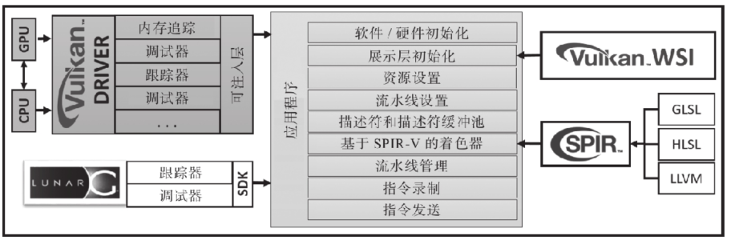

### 驱动

支持Vulkan的系统至少要包含一个CPU和一个GPU。独立的硬件供应商会根据自己的GPU架构为某个Vulkan标准提供完整的驱动实现。驱动为应用程序提供高级的功能接口，使其可以与设备进行通信。

### 应用程序

应用程序指的是用户编写的程序。应用程序启动时需要先初始化硬件和软件，可以检测驱动并调取所有Vulkan API。展示层初始化需要WSI(Window System Integration,Vulkan窗口系统集成API)来完成。应用程序负责创建资源并且把它们绑定到着色器阶段，这里用到了描述符。描述符可以辅助将创建后的资源绑定到底层的(基于某种图形或者计算类型的)流水线对象。最后，应用程序还要记录指令缓存并发送到队列中继续执行。

### WSI

窗口系统集成库是由Khronos提供的一套功能扩展，可以将不同操作系统平台上的展示层统一起来，包括Linux、Windows和Android。

### SPIR-V

SPIR-V提供了一套预编译的二进制数据格式，用来设置给Vulkan的着色器。不同的着色器源代码语言，包括GLSL和HLSL的各种变种，都可以通过编译器产生SPIR-V格式的数据。

### LunarG SDK

LunarG提供了一套Vulkan SDK，其中带有多种不同的工具和资源，可以辅助Vulkan程序的开发。这些工具和资源包括Vulkan的加载器、验证层、跟踪和回放工具、SPIR-V工具、Vulkan的运行时安装程序、文档、示例和演示程序。

## 了解Vulkan的编程模型

- Vulkan的编程模型
- 渲染的执行模型
- Vulkan的工作流程

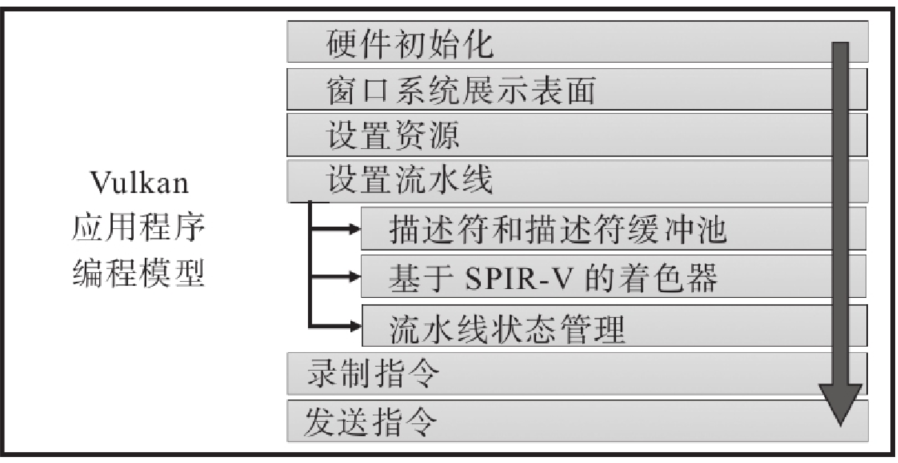

### 硬件初始化

当一个Vulkan应用程序启动的时候，它的第一项工作就是初始化硬件设备。应用程序需要与加载器进行通信来激活Vulkan的驱动

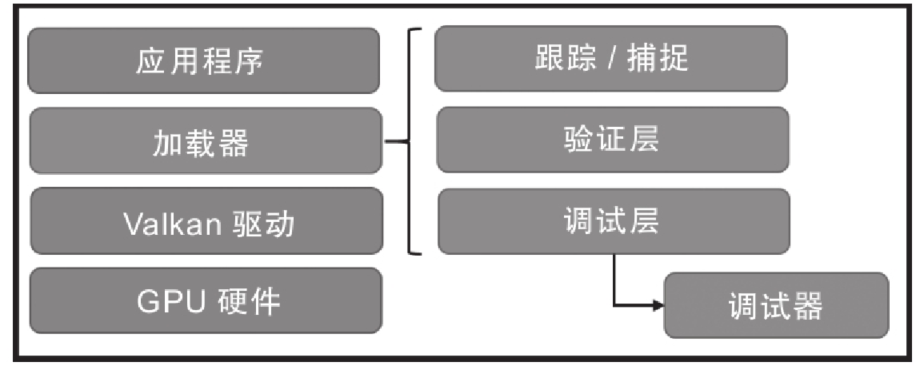

加载器：加载器是一段应用程序启动时执行的代码，它使用平台无关的方式来定位系统中的Vulkan驱动。

定位驱动：这是加载器的主要职责，它需要从当前系统中的指定位置来定位Vulkan驱动。如果找到了驱动程序，那么将加载它。

平台无关性：初始化Vulkan的过程对于所有的系统平台来说都是相同的。

注入层：加载器支持层次化的结构，并且可以在运行过程中随时注入不同类型的层。

当加载器定位到驱动位置并成功链接到API之后，应用程序就可以开始执行下面的操作了：

- 创建一个Vulkan实例。
- 查询物理设备上所有的可用队列。
- 查询扩展功能并保存为新的函数指针，例如WSI或者有特定功能的API。
- 支持注入层来实现错误检查、调试或者验证的功能。

### 窗口展示表面

### 资源设置

设置资源的过程意味着将数据存储到内存区域中。

内存堆可以按照其表现形式，划分为两种不同的类型：

- 宿主本地（host local）：这是一种速度较慢的内存。

- 设备本地（device local）：这是一种带宽更高的内存类型，速度较快。

内存堆也可以按照其配置方式进行划分：

设备本地（device local）：这种类型的内存是关联到物理设备的。

- 对设备可见。
- 对宿主不可见。

设备本地，宿主可见（device local，host visible）：这种类型的内存也是关联到物理设备的。

- 对设备可见。
- 对宿主可见。

宿主本地，宿主可见（host local，host visible）：它是宿主机的本地内存，但是速度比本地设备更慢。

- 对设备可见。
- 对宿主可见。

在资源设置的阶段，用户需要先后执行如下任务：
1）创建一个资源对象；
2）查询应用程序内存实例，创建一个内存对象，例如缓存或者图像；
3）获取对象分配相应的内存需求；
4）分配空间并且保存数据到其中；
5）将内存绑定到我们创建的资源对象上。

### 流水线设置

流水线指的是根据应用程序逻辑定义的一系列事件，它们按照固定的顺序执行。

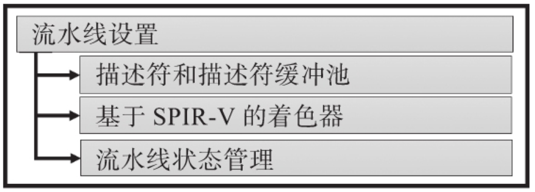

1.描述符集以及描述符缓冲池
描述符集合指的是资源和着色器之间的接口。它的结构非常简单，可以将着色器绑定到资源，例如图像或者缓存。它也可以将资源内存关联或者绑定到准备使用的着色器实例上。

2.基于SPIR-V的着色器
Vulkan中设置着色器或者计算内核的唯一方法就是通过SPIR-V完成。

3.流水线的管理
物理设备包括一系列硬件设置，用来定义准备发送的几何输入数据是如何解释和绘制的。

4.指令的记录
指令的记录是逐渐构成指令缓存的过程。指令缓存是从指令内存池当中分配而来的。指令池可以用来同时分配多个指令缓存。应用程序定义了指令的开始和结束位置之后，就可以将指令记录到指令缓存当中。

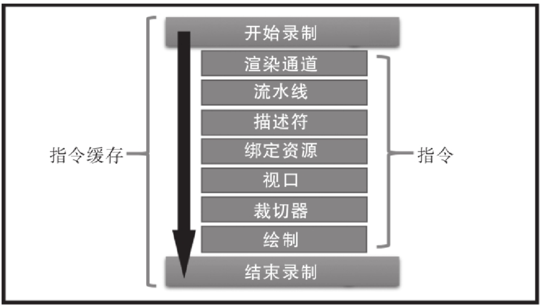

5.队列的提交
当指令缓存构建完成后，我们就可以将它们提交到队列中处理。Vulkan向应用程序暴露了不同类型的队列接口。队列的选择和提交非常依赖于工作本身的性质。例如，图像相关的任务是必须提交给图像队列的。与此类似，对于计算相关的操作，最好的选择肯定是传递给计算队列。

## Vulkan代码程序

### 1、初始化 —— 与设备握手的过程

Vulkan的初始化过程包括验证层属性的初始化，以及实例对象（VkInstance）的构建。当实例创建完成之后，需要检查当前系统是否存在可用的物理设备（VkPhysicalDevice）。选择可用的物理设备，并通过实例对象创建一个对应的逻辑设备（VkDevice）。

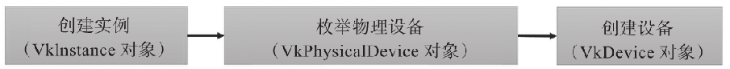

初始化过程需要步骤：

1）枚举实例层属性  (Vulkan首先要和加载器进行通信并定位驱动位置。驱动中包含了多个功能扩展和层对象，对于不同的GPU供应商，这些对象可能也有所不同。)

2）创建实例

3）创建设备 (枚举当前系统中所有的物理设备或者GPU的数量)

​    当我们已经获取了物理设备的列表之后，可以查询以下设备信息。

​         队列和队列的类型

​         内存信息

​         物理设备属性

### 2、交换链初始化——查询WSI扩展

展示层负责将已经渲染完成的内容显示到输出窗口中。

展示层初始化过程

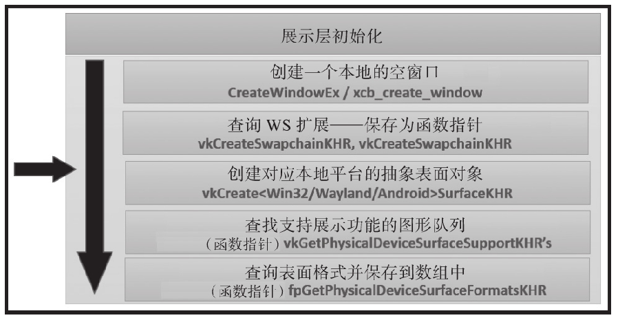

1.指令缓存初始化——分配指令缓存

- 指令池创建
- 分配指令缓存

指令缓存池

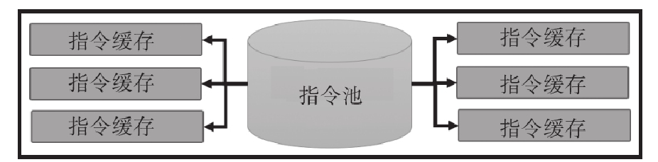

2.资源对象——管理图像和缓存

Vulkan将资源分为两种类型：缓存和图像

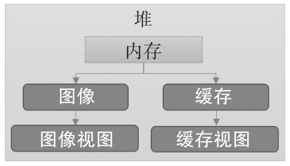

3.创建展示表面——创建交换链

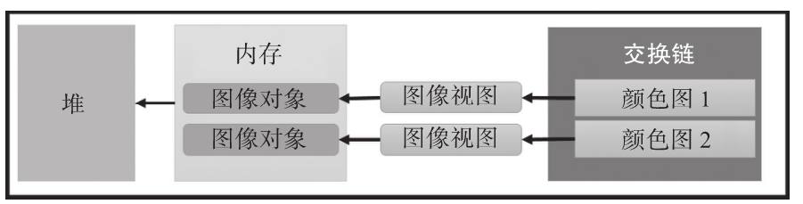

4.创建深度图像

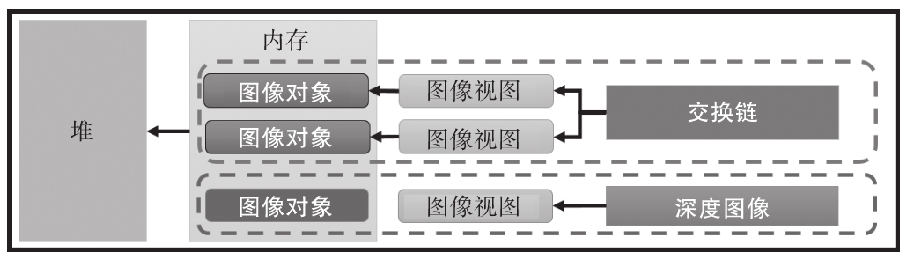

5.资源分配——分配和绑定设备内存

Vulkan的资源（缓存为VkBuffer，图像为VkImage）刚刚被创建时，并没有关联任何的内存空间。因此在我们使用某个资源之前，必须先为它分配内存空间，并且将资源绑定到该内存。

### 3、着色器支持——将着色器编译到SPIR-V

### 4、构建布局——描述符与流水线布局

描述符负责将资源与着色器通过布局绑定的方式关联起来。

### 5、创建渲染通道——定义通道属性

渲染通道包括子通道和附件。它描述了绘制操作的结构、数据在各个附件之间流转的方式以及顺序的要求。

### 6、帧缓存——将绘制图像关联到渲染通道

帧缓存指的是图像视图的一个集合，它的内容与渲染通道中定义的各个附件是一一对应的。

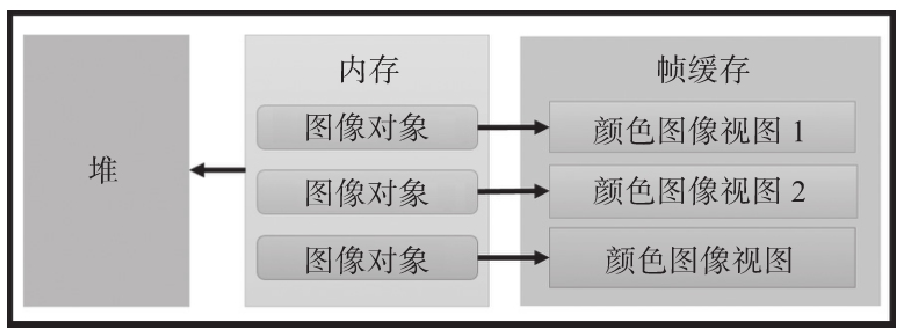

### 7、产生几何体——在GPU内存中保存一个顶点

### 8、流水线状态管理——创建流水线

流水线是一系列状态的集合。每个状态都包括了一组属性，用来定义状态的执行协议。这些状态组合在一起就构成了一条流水线。

### 9、执行渲染通道——显示Hello World！！！

### 10、队列的提交和同步——发送任务

我们已经成功地记录了多个指令到指令缓存中，其中包括了渲染通道的信息和图形流水线对象。下一步我们需要将指令缓存发送到队列。驱动程序会开始读取指令缓存并且准备调度和执行。

### 11、使用展示层进行显示——渲染三角形

当我们发送指令缓存到队列中之后，物理设备层面将采用异步的方式来进行处理。

### 整个工作模型

首先，应用程序创建Vulkan的实例以及设备，初始化必要的层和扩展功能。设备包含了两种不同的队列（图形和计算），如图2-13所示。队列负责收集指令缓存并发送它们到物理设备进行处理。
通过WSI扩展，我们可以设置绘制表面来执行图形内容的渲染。交换链可以将绘制表面作为图像来使用，但是必须采用图像视图的方式。与此类似，它也提供了深度图像视图。这些图像视图可以被帧缓存所使用。渲染通道则使用帧缓存来执行单元渲染的操作。
指令缓存是从指令缓存池中分配得到的，在渲染通道的执行过程中，它被用来记录各种指令。渲染通道的执行需要用到一些关键的Vulkan对象，例如图形流水线、描述符集合、着色器模块、流水线对象，以及几何体数据，如图所示。
最后，指令缓存被发送到展示（图形）的队列。发送完成后，GPU层面会以异步的方式来处理指令。我们在这里可以使用多种同步的机制和内存屏障来确保渲染的过程正确。

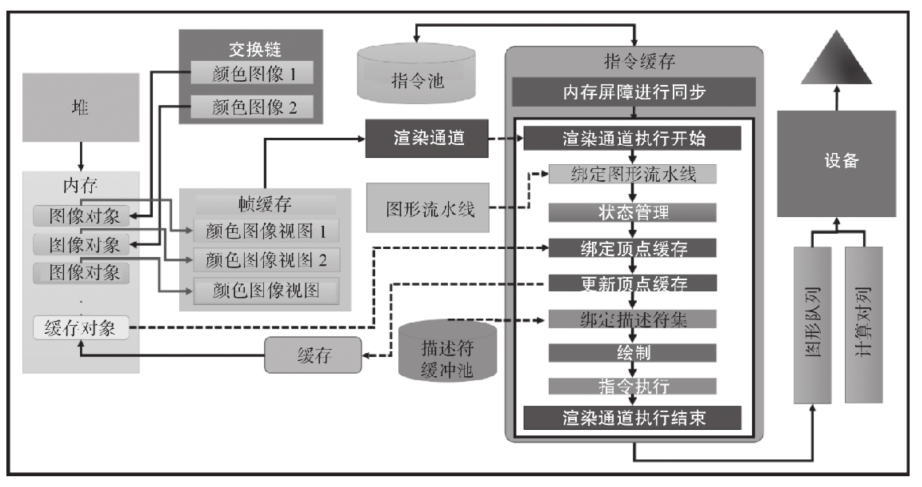

